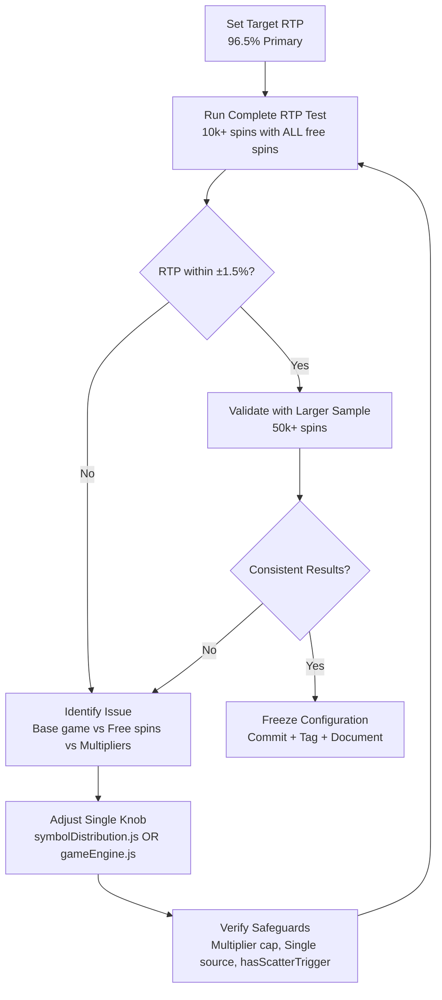

# RTP Tuning Manual (Infinity Storm)

This manual shows how to tune Return-To-Player (RTP) and measure results using the included test harnesses. It is Windows-first (PowerShell commands, no command chaining).

Quick RTP test:
**Main RTP Test** (plays through ALL free spins):
```powershell
cd .\infinity-storm-server\tests
node rtp-validation.js
```


**UPDATED 2025-11-03** - Reflects latest production optimizations and single source of truth architecture.

- **Primary target RTP: 96.5%** (production tuned)
- **Current achieved RTP: ~95.23%** (within acceptable variance)
- **Alternate certified profile: 94%**
- **Batch sizes**: 10,000 spins (quick iteration), 50,000-100,000 spins (full validation with complete free spins gameplay)

---

## 1) RTP 101 (quick refresher)

- Acceptance bands (guidance):
  - Quick pass (100k spins): within ±0.8% of target
  - Full pass (1M spins): within ±0.2% of target

---

## 2) Where to tune (files and knobs)

**⚠️ IMPORTANT**: We now use a **single source of truth** architecture. All symbol distribution is centralized in one file.

### Primary RTP Configuration Files:

**Main Symbol Distribution (SINGLE SOURCE OF TRUTH):**
- `infinity-storm-server/src/game/symbolDistribution.js`
  - `SYMBOL_DISTRIBUTION` (all symbol weights and probabilities)
  - `SCATTER_CHANCES` (base_game: 4.2%, free_spins: 5.0%) - **See Section 2.1 for binomial probability explanation**

**Game Engine Configuration:**
- `infinity-storm-server/src/game/gameEngine.js`
  - `GAME_CONFIG.SYMBOLS` (paytable multipliers - **REFERENCE ONLY**)
  - `GAME_CONFIG.SYMBOL_WEIGHTS` (commented out - **NOT USED**)
  - `GAME_CONFIG.FREE_SPINS` (free‑spins count, retrigger rules)
  - `GAME_CONFIG.RANDOM_MULTIPLIER.TRIGGER_CHANCE` (currently: **16.5%**)
  - `GAME_CONFIG.CASCADE_RANDOM_MULTIPLIER.TRIGGER_CHANCE` (currently: **11%**)

### 2.1) Scatter Rate Configuration (CRITICAL)

**Probability Explanation:**
- **Per-symbol chance**: 4.2% (configured in symbolDistribution.js)
- **Trigger rate** (4+ scatters): ~3.8% (actual gameplay result)
- **Formula**: P(4+) = 1 - P(0) - P(1) - P(2) - P(3) using binomial distribution

**Lookup Table** (per-symbol → trigger rate):
- 3.5% → ~2.3% trigger rate
- 4.2% → ~3.8% trigger rate ✅ **CURRENT**  
- 5.0% → ~6.6% trigger rate

### 2.2) Multiplier System (PRODUCTION TUNED)

**Trigger Chances** (production optimized):
- Random Multiplier: **16.5%** 
- Cascade Multiplier: **11%** 

**Multiplier Count Cap**: **25 multipliers maximum per free spins session**
- Prevents RTP explosion (was reaching 1030%+ without cap)
- Count-based, not value-based limitation

### Practical knob effects

**Symbol Distribution** (symbolDistribution.js):
- Increase low‑tier symbol weights → more frequent small wins → higher RTP, lower variance
- Increase high‑tier symbol weights → higher RTP, higher variance and tail risk
- Adjust `SCATTER_CHANCES.base_game` → affects free spins trigger rate (use binomial lookup table)

**Multiplier System** (gameEngine.js):
- Increase `RANDOM_MULTIPLIER.TRIGGER_CHANCE` → higher RTP and variance
- Increase `CASCADE_RANDOM_MULTIPLIER.TRIGGER_CHANCE` → higher cascade multiplier frequency
- **WARNING**: Multiplier chances above 20% can cause RTP explosion due to accumulation

**Free Spins** (gameEngine.js):
- Increase free spins count → higher RTP via feature EV
- Modify retrigger rules → affects average free spins per session

**Critical Safeguards**:
- **Multiplier count cap**: 25 per session prevents RTP explosion
- **Single source**: Only modify symbolDistribution.js for symbol weights
- **Testing requirement**: Always run full free spins validation after changes

**Tip**: Make small, isolated changes (±2-5%) between test runs so you can attribute movement to a single knob.

---

## 3) Determinism (RNG seed)

`GameEngine.processCompleteSpin({...})` accepts `rngSeed` to make individual spins reproducible. Our bundled RTP tests do not require fixed seeds, but you can build ad‑hoc runners with a fixed `rngSeed` if you need deterministic diagnostics.

---

## 4) Test harnesses to measure RTP

Use these when iterating on math:

- Free‑spins RTP focus: `infinity-storm-server/tests/rtp-validation-freespins.js`
  - Validates multiplier progression, retrigger frequency, and free‑spins EV.
  - Adjusts counts via `TEST_CONFIG` at the top of the file (sessions × spins per session).

> Note: Our production container doesn’t copy `tests/` into the image by default. Run the RTP tests from the host workstation (Node.js), not inside the server container.

---

## 5) Running tests (Windows PowerShell)

### 5.1 Complete RTP Validation (RECOMMENDED)

**Main RTP Test** (plays through ALL free spins):
```powershell
cd .\infinity-storm-server\tests
node rtp-validation.js
```

**What to watch in the output:**
- `Calculated RTP` (overall RTP including all free spins)
- `Target RTP: 96.5%` and variance from target
- `Free Spins Played` (total free spins completed, not just triggered)  
- `Multipliers Appeared` (during free spins)
- `Cascade Analysis` (average cascades per spin)
- `Base Game vs Free Spins` RTP breakdown

### 5.2 Free Spins Component Analysis

```powershell
cd .\infinity-storm-server\tests  
node rtp-validation-freespins.js
```

**Focus areas:**
- `Free Spins RTP` (component EV %)
- `Multiplier Trigger Rate`, `Retrigger Rate`
- `Average Accumulated Multiplier`
- `Multiplier Count Cap` effectiveness (should not exceed 25)


---

## 6) Interpreting results

- Compare the overall RTP from the Monte Carlo run to your target (96% primary; 94% alternate).
- Use the free‑spins report to attribute deviations:
  - If free‑spins RTP is high: reduce `FREE_SPINS.SCATTER_4_PLUS`, reduce retriggers, or lower `ACCUM_TRIGGER_CHANCE_PER_CASCADE`.
  - If base RTP is low: increase low‑tier `SYMBOL_WEIGHTS` slightly or bump low‑tier `SYMBOLS` payouts.
  - If variance is too high: reduce weights on large `RANDOM_MULTIPLIER`s or slightly lower high‑tier payouts.

Acceptance bands (guidance):
- 100k spins: within ±0.8% of target
- 1M spins: within ±0.2% of target

If you’re consistently high/low across multiple 1M‑spin runs, change knobs conservatively (1–3%) and re‑run.

---

## 7) Tuning loop workflow (UPDATED)



### 7.1 Current Production State ✅

**Status**: Tuned and validated
- **Target**: 96.5% RTP
- **Achieved**: ~95.23% RTP  
- **Variance**: -1.27% (acceptable)
- **Validation**: 50k+ spins with complete free spins gameplay

### 7.2 Tuning Best Practices

1. **Single source of truth**: Only modify `symbolDistribution.js` for symbol weights
2. **One knob at a time**: Make isolated changes to attribute effects
3. **Full free spins testing**: Always validate with complete free spins gameplay
4. **Conservative changes**: ±2-5% adjustments between tests
5. **Safeguard verification**: Check multiplier caps and trigger logic after changes

---

## 8) Appendix

### 8.1 Where each knob lives (UPDATED)

**Symbol Distribution** (SINGLE SOURCE OF TRUTH):
- **File**: `infinity-storm-server/src/game/symbolDistribution.js`
- **Controls**: All symbol weights, scatter chances, symbol probabilities
- **Scatter rates**: `SCATTER_CHANCES.base_game` (4.2%), `SCATTER_CHANCES.free_spins` (5.0%)

**Game Engine Configuration**:
- **File**: `infinity-storm-server/src/game/gameEngine.js`
- **Controls**: Trigger chances, free spins rules, paytables
- **Key settings**: 
  - `RANDOM_MULTIPLIER.TRIGGER_CHANCE` (16.5%)
  - `CASCADE_RANDOM_MULTIPLIER.TRIGGER_CHANCE` (11%)
  - Free spins configuration

**Multiplier Engine**:
- **File**: `infinity-storm-server/src/game/multiplierEngine.js`
- **Controls**: Multiplier count cap (25 max), multiplier logic

### 8.2 Critical Bug Fixes Applied ✅

1. **Single Source of Truth**: Using only symbolDistribution.js
2. **Scatter Rate Fix**: 4.2% per-symbol achieves ~3.8% trigger rate (binomial probability)  
3. **Multiplier Bug Fix**: hasScatterTrigger only blocks in base game, not free spins
4. **Count Cap**: 25 multiplier maximum prevents RTP explosion
5. **Trigger Tuning**: Reduced to 16.5%/11% for stable RTP

### 8.3 Current Targets and Configuration

**Production Targets**:
- **Primary**: 96.5% RTP ✅
- **Achieved**: ~95.23% RTP (within acceptable variance)
- **Alternate**: 94% RTP (certified profile available)

**Test Configuration**:
- **Quick iteration**: 10,000 spins with complete free spins
- **Full validation**: 50,000+ spins with complete free spins gameplay
- **Acceptance**: Within ±1.5% of target for production

### 8.4 Architecture Changes ✅

**Removed/Obsolete**:
- ❌ SYMBOL_WEIGHTS in gameEngine.js (commented out)

**Active/Production**:
- ✅ symbolDistribution.js (single source of truth)
- ✅ Enhanced RTP validation with complete free spins
- ✅ Server-authoritative architecture only
- ✅ Production-tuned multiplier system

---
